# 🎮 CoinDrop - Web3 Physics Game

<p align="center">
  
</p>

A skill-based physics game built on the Monad blockchain featuring realistic water mechanics and glassmorphism UI.


## 🌟 Features

- **Realistic Physics**: Matter.js powered physics simulation with water deflection
- **Premium UI**: Glassmorphism design with smooth animations
- **Web3 Integration**: Built for Monad blockchain with MetaMask support
- **Smart Contract**: Solidity contract for on-chain game verification
- **Backend API**: Node.js/Express backend for leaderboards and statistics
- **Demo Mode**: Play without blockchain connection

## 🎯 Game Mechanics

Drop a coin into a container filled with water. The goal is to land the coin in a small target glass at the bottom. Water creates realistic deflection, making precision crucial!

- Adjust drop angle (0-360°)
- Control drop force
- Physics-based water resistance
- Particle effects and animations

## 🚀 Quick Start

### Prerequisites

- Node.js (v16 or higher)
- MetaMask browser extension
- Monad network access (for blockchain features)

### Installation

1. **Clone the repository**
```bash
git clone https://github.com/manikant1446/DropCoinGame.git
cd DropCoinGame
```

2. **Start the frontend**
```bash
# Option 1: Using Node.js
node server-simple.js

# Option 2: Using PowerShell (Windows)
.\start-server.ps1
```

3. **Setup backend** (optional)
```bash
cd backend
npm install
cp .env.example .env
# Edit .env with your configuration
npm start
```

4. **Open the game**
```
[http://localhost:8080](https://dropcoin-psi.vercel.app/)
```

## 📁 Project Structure

```
coindrop/
├── index.html              # Main game page
├── style.css               # Glassmorphism UI styles
├── game.js                 # Main game controller
├── physics.js              # Matter.js physics engine
├── web3.js                 # Web3/MetaMask integration
├── particles.js            # Particle effects system
├── config.js               # Game configuration
├── contract-abi.js         # Smart contract ABI
├── CoinDrop.sol           # Solidity smart contract
├── backend/               # Backend API
│   ├── server.js          # Express server
│   ├── database.js        # SQLite database
│   └── blockchain-listener.js
└── docs/                  # Documentation
    ├── DEPLOYMENT.md      # Contract deployment guide
    ├── QUICKSTART.md      # Quick start guide
    └── NETWORK-GUIDE.md   # Network configuration
```

## 🎮 How to Play

### Demo Mode (No Wallet)
1. Open http://localhost:8080
2. Adjust angle and force sliders
3. Click "Drop Coin"
4. Watch the physics simulation!

### Blockchain Mode
1. Install MetaMask
2. Connect to Monad network
3. Click "Connect Wallet"
4. Place bets and earn rewards!

## 🔧 Configuration

Edit `config.js` to customize:
- Physics parameters (gravity, resistance)
- Container dimensions
- Bet amounts
- Network settings (RPC URL, chain ID)

## 📜 Smart Contract

The `CoinDrop.sol` contract handles:
- Bet placement and validation
- Game result verification
- Player statistics tracking
- Payout distribution

### Deployment

See [DEPLOYMENT.md](DEPLOYMENT.md) for detailed instructions.

```bash
# Using Remix IDE or Hardhat
# Update config.js with deployed contract address
```

## 🌐 Backend API

The backend provides:
- `/api/leaderboard` - Top players
- `/api/recent-games` - Latest game results
- `/api/player/:address` - Player statistics
- `/api/stats` - Global statistics

See [backend/README.md](backend/README.md) for full API documentation.

## 🛠️ Technology Stack

**Frontend:**
- HTML5 Canvas
- CSS3 (Glassmorphism)
- JavaScript (ES6+)
- Matter.js (Physics)
- ethers.js (Web3)

**Backend:**
- Node.js
- Express.js
- SQLite
- ethers.js

**Blockchain:**
- Solidity 0.8.19
- Monad Network
- MetaMask

## 🎨 Design Features

- Glassmorphism UI with blur effects
- Vibrant gradient backgrounds
- Smooth animations and transitions
- Particle systems (water splashes, coin trails)
- Responsive layout

## 📊 Game Statistics

Track your performance:
- Total games played
- Win/loss ratio
- Total winnings
- Global leaderboard ranking

## 🔐 Security

- Smart contract reentrancy protection
- Bet amount limits
- Game expiration mechanism
- Player verification
- API rate limiting

## 🤝 Contributing

Contributions are welcome! Please feel free to submit a Pull Request.

## 📝 License

This project is licensed under the MIT License.

## 🙏 Acknowledgments

- Matter.js for physics engine
- ethers.js for Web3 integration
- Monad for blockchain infrastructure

## 📞 Support

For issues and questions:
- Open an issue on GitHub
- Check [QUICKSTART.md](QUICKSTART.md) for common problems
- Review [NETWORK-GUIDE.md](NETWORK-GUIDE.md) for network setup

## 🚧 Current Status

- ✅ Frontend: Complete
- ✅ Smart Contract: Complete
- ✅ Backend API: Complete
- ⚠️ Blockchain: Waiting for Monad public network
- ✅ Demo Mode: Fully functional

---

**Built with ❤️ for the Monad ecosystem**
